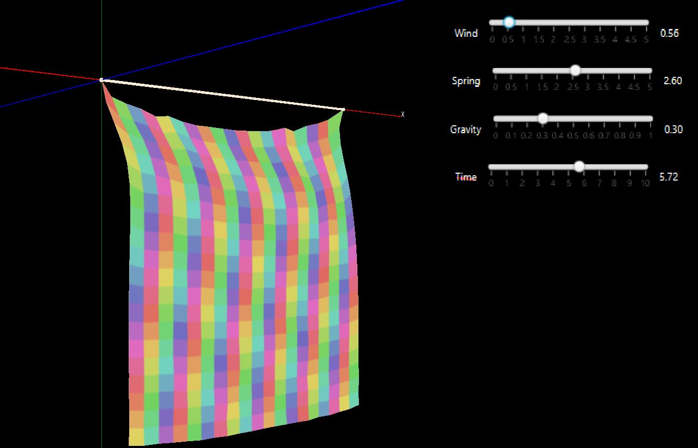
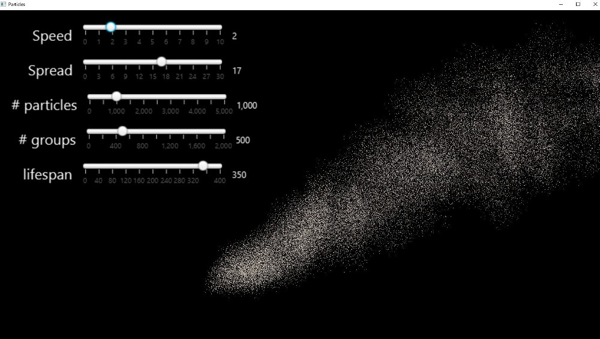

# jfx-examples
JavaFX examples

By Donald A. Smith, ThinkerFeeler@gmail.com

### cloth.ClothMesh:

 Cloth model of 3d TriangleMesh in Javafx, with wind, gravity and spring forces between point masses.
 The program is a JavaFX application with sliders for controlling the wind speed, the spring force, the gravity,
 and the simulation speed.

 See cloth-screenshot.jpg for a screenshot.

 

 Video at https://youtu.be/O7H5Y_y7Ytk

### particles.Particles

Simulation of smoke/particles, with sliders that let you control the shape, size, and longevity of the smoke.
 

## To Build
mvn compile

## To Run
Run via:

    mvn javafx:run

or commands like:

/c/Program\ Files/Java/jdk1.8.0_221/bin/java -cp target/classes/ cloth.ClothMesh

/c/Program\ Files/Java/jdk1.8.0_221/bin/java -cp target/classes/ particles.Particles

If you use Java 8, javafx libraries are already included.
